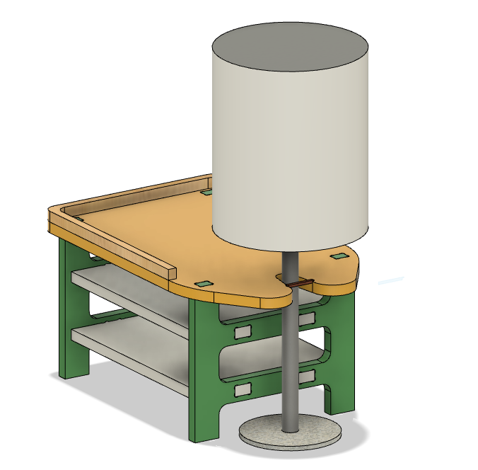
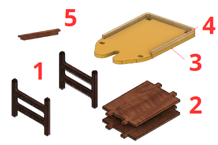

# Organizador para velador

Este diseño surge a partir de la necesidad de organizar el espacio utilizado por los objetos que se colocan sobre un velador y mejorar la estabilidad de la lampara ubicada en este. Cuenta con estantes para colocar libros, una bandeja central para items de uso diario (como reloj, billetera y collares) y una apertura para acople con lámpara. 

 

## Lista de materiales 
- Pliego de madera terciada 12mm de dimensiones 65cm x 51cm
- 1gr de filamento PLA para impresión 3D
- Pegamento de madera
- Almohadilla fieltro
- Palos pequeños de madera ("palitos de helado", o "palitos para manualidades")

## Fabricación Partes y ensamble
El proyecto consta de 5 piezas principales: 

 

| # | Parte         | Material | Fabricación  |
|---|---------------|----------|--------------|
| 1 | Paredes       | Madera   | Corte CNC    |
| 2 | Estante       | Madera   | Corte CNC    |
| 3 | Base Bandeja  | Madera   | Corte CNC    |
| 4 | Borde Bandeja | Madera   | Corte CNC    |
| 5 | Tope Lámpara  | PLA      | Impresión 3D |

1. Realizar el corte de las piezas de madera acorde al archivo de diseño *corteCNC.f3d* presente en **/archivos/construcción**

## Costos

## Posible mejoras

El material gráfico es suficiente para entender de qué se trata el proyecto. 10 El texto entrega suficiente información para caracterizar la función y atributos del proyecto 10 Los listados solicitados están completos (materiales, partes, procesos, etc). 10 Las instrucciones de ensamble son suficientes para entender como armar el proyecto. 
